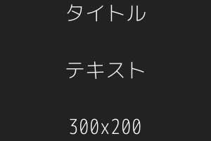

# Dummy PlaceHolder Image For Local

---

Used when generating dummy placeholder images in the local environment

## Demo



## Requirement

+ [aheckmann/gm](https://github.com/aheckmann/gm)
  + imagemagick
  + graphicsmagick

## Usage

```
local_placeholder_image start

Options:
  -p, --port <value>  PORT Number (default: 9999)
  -h, --help          output usage information
```

1. `local_placeholder_image start`
1. Access Image
  + `http://localhost:9999/タイトル/テキスト/300x200.png`
  + ``

## Anything Else

+ [(Font) M+ Font](http://mplus-fonts.osdn.jp/about.html)

## Author

[TakeshiOnishi](https://github.com/TakeshiOnishi)

## License

[MIT](https://github.com/TakeshiOnishi/dotfiles/blob/master/etc/template/LICENSE.txt)
